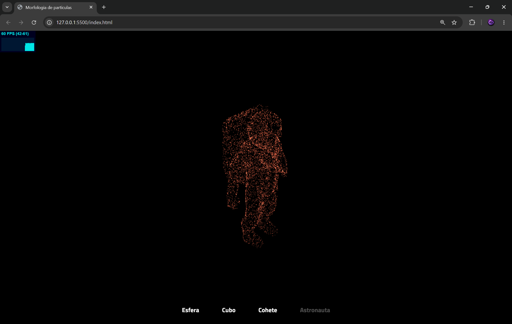

# Morfología de Partículas

Escena 3D interactiva que anima 6,000 partículas morfeando entre cuatro formas: esfera, cubo, cohete y astronauta. Construida con Three.js r128, GSAP y OrbitControls.

---

## Vista previa

Las partículas arrancan en el origen y se animan elásticamente hacia la forma seleccionada. El sistema rota continuamente sobre el eje Y y acepta rotación libre con el ratón vía OrbitControls.

---

## Estructura del proyecto

```
├── index.html   # Entrada principal, carga de dependencias
├── index.js     # Lógica Three.js, morph y animación
└── styles.css   # Estilos del UI y los disparadores
```

---

## Dependencias

Todas se cargan desde CDN, no se requiere instalación.

| Librería | Versión | Uso |
|---|---|---|
| Three.js | r128 | Motor 3D, geometrías, renderizado WebGL |
| OrbitControls | r128 | Rotación de cámara con el ratón |
| OBJLoader | r128 | Carga de modelos `.obj` (cohete y astronauta) |
| GSAP TweenMax | 1.20.3 | Animación de morph y velocidad de rotación |
| Stats.js | r17 | Panel de FPS en esquina superior izquierda |
| Titillium Web | — | Tipografía de los botones UI |

> **Nota:** Se usa Three.js r128 específicamente porque es la última versión que expone la API global `THREE.*` sin módulos ES. Versiones posteriores (r130+) requieren importación por módulos y romperían la arquitectura de scripts actuales.

---

## Cómo usar

1. Clona o descarga los tres archivos en la misma carpeta.
2. Sirve el proyecto desde un servidor local (no funciona abriendo `index.html` directamente por restricciones CORS al cargar los `.obj`):

```bash
# Python 3
python -m http.server 8080

# Node.js (npx)
npx serve .
```

3. Abre `http://localhost:8080` en el navegador.
4. Usa los botones en la parte inferior para cambiar de forma.
5. Arrastra con el ratón para rotar la cámara libremente.

---

## Configuración

Las constantes principales están al inicio de `index.js`:

| Variable | Valor por defecto | Descripción |
|---|---|---|
| `numeroDePArticulas` | `6000` | Cantidad total de partículas |
| `tamanoDeParticula` | `0.2` | Tamaño de cada partícula |
| `colorDeParticula` | `0xFFFFFF` | Color base (blanco) |
| `velocidadAnimacionPorDefecto` | `1` | Velocidad de rotación normal |
| `velocidadAnimacionMorph` | `3` | Velocidad de rotación durante el morph |

---

## Cómo funciona

### Geometría
Cada forma de destino se representa como una `THREE.BufferGeometry` con exactamente `numeroDePArticulas` vértices. Los modelos OBJ se muestrean aleatoriamente por área de triángulo (función `puntosAleatoriosEnGeometria`) para distribuir las partículas de forma uniforme sobre la superficie.

### Morph
Al seleccionar una forma, `morphHacia()` lanza un `TweenMax.to` por partícula con `ease: Elastic.easeOut`, interpolando cada vértice desde su posición actual hacia el destino y actualizando el `BufferAttribute` en cada frame del tween (`onUpdate`).

### Rotación
La velocidad de rotación se acelera brevemente durante el morph (`velocidadCompleta`) y vuelve a `velocidadNormal` con un tween de desaceleración (`reducirVelocidad`).

---

## APIs de Three.js migradas

El código original usaba APIs eliminadas en Three.js r125+. Esta versión las reemplaza:

| API eliminada | Reemplazo usado |
|---|---|
| `THREE.Geometry` | `THREE.BufferGeometry` |
| `THREE.PointCloud` | `THREE.Points` |
| `THREE.PointCloudMaterial` | `THREE.PointsMaterial` |
| `THREE.ImageUtils.loadTexture()` | `new THREE.TextureLoader().load()` |
| `THREE.GeometryUtils.randomPointsInGeometry()` | Implementación propia con muestreo baricéntrico |
| `geometry.vertices[i]` + `verticesNeedUpdate` | `BufferAttribute.setXYZ()` + `attr.needsUpdate` |

---

## Recursos externos

Los modelos 3D se cargan desde un bucket público de CodePen:

```
https://s3-us-west-2.amazonaws.com/s.cdpn.io/605067/CartoonRocket.obj
https://s3-us-west-2.amazonaws.com/s.cdpn.io/605067/Astronaut.obj
```

Si los modelos no cargan (CORS o bucket caído), los botones **Cohete** y **Astronauta** permanecerán deshabilitados. Los botones **Esfera** y **Cubo** siempre funcionan porque usan geometrías internas de Three.js.

## Captura



## Pagina

https://morfologia-de-particulas.vercel.app/